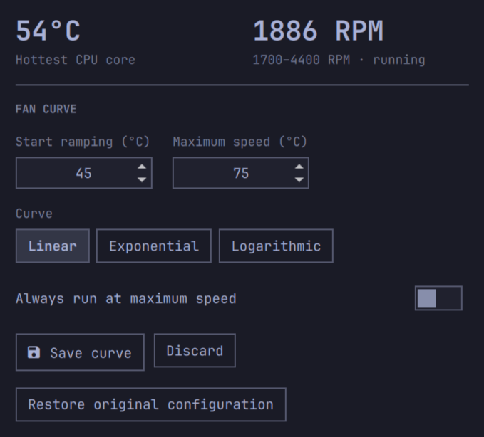

# T2 Fan Control for Omarchy

An Omarchy Shell bar widget for monitoring Apple T2 Mac thermals and editing
the existing `t2fanrd` fan curve.



It displays the hottest CPU core and every fan exposed by `applesmc`. One-fan
Macs keep the compact hero view; two-fan models gain a small per-fan RPM list.

## Requirements

- An Apple T2 Mac with the `applesmc` kernel driver
- `t2fanrd` installed and enabled
- `pkexec`/PolicyKit for authenticated configuration changes

The widget reads fan speed and temperatures without privilege. Saving a curve
uses a separately installed, root-owned helper and opens a graphical
administrator prompt. The helper validates all values, preserves the original
`/etc/t2fand.conf`, and restarts `t2fanrd`. If the restart fails, it restores
the previous configuration automatically.

## Install

```bash
omarchy plugin add https://github.com/Endijs/omarchy-t2-fan-control.git
cd ~/.config/omarchy/plugins/io.github.endijs.t2-fan-control
sudo ./contrib/install-helper.sh
omarchy plugin enable io.github.endijs.t2-fan-control --section right
```

The second step installs the configuration helper at
`/usr/local/libexec/omarchy-t2-fan-control` and its PolicyKit action. Monitoring
works without this step, but saving and restoring fan curves remain disabled.
Plugin updates intentionally cannot replace this root-owned copy. After
updating the plugin, review the changes and rerun
`sudo ./contrib/install-helper.sh` to install the matching helper version.

For local development, place the repository at
`~/.config/omarchy/plugins/io.github.endijs.t2-fan-control`, then run:

```bash
omarchy plugin validate ~/.config/omarchy/plugins/io.github.endijs.t2-fan-control
omarchy-shell shell rescanPlugins
omarchy plugin enable io.github.endijs.t2-fan-control --section right
```

## Fan curves

- `linear`: even ramp between the low and high temperature
- `exponential`: quieter initially, steeper near the high temperature
- `logarithmic`: stronger cooling earlier in the range

`always_full_speed` can be used continuously for maximum cooling, at the cost
of additional noise, power use, dust accumulation, and fan wear.

## Remove

Before removing the plugin, open the widget and select **Restore original**
twice to confirm. After administrator authentication, the helper restores the
configuration captured before the plugin's first save and restarts `t2fanrd`.
Then remove the plugin:

```bash
cd ~/.config/omarchy/plugins/io.github.endijs.t2-fan-control
sudo ./contrib/install-helper.sh --uninstall
omarchy plugin remove io.github.endijs.t2-fan-control
```

Omarchy does not run plugin uninstall hooks, so removing the plugin without
restoring first leaves the current fan curve in place. If the plugin was
already removed, reinstall it and use **Restore original** before removing it
again. Remove the installed helper before deleting the plugin because Omarchy
does not run uninstall hooks. Removing the plugin never removes `t2fanrd`.

## Security

The status path is unprivileged and reads only sysfs, `/etc/t2fand.conf`, and
the `t2fanrd` service state. Routine widget actions never execute the
user-writable plugin checkout as root. Saving invokes `pkexec` with the fixed,
root-owned helper at
`/usr/local/libexec/omarchy-t2-fan-control`, and its PolicyKit action pins that
exact path. Every configuration change therefore requires the desktop's normal
administrator prompt, while a plugin update cannot replace the privileged
executable.

The helper accepts only bounded integer temperatures, three known curve names,
and a boolean full-speed value. On the first save it stores an immutable
snapshot at `/var/lib/omarchy-t2-fan-control/original-t2fand.conf`; later saves
never replace that snapshot. A successful restore deletes the snapshot so it
cannot be reused after a later reinstall. Each save and restore also uses a
temporary rollback copy if `t2fanrd` fails to restart.

## License

MIT
